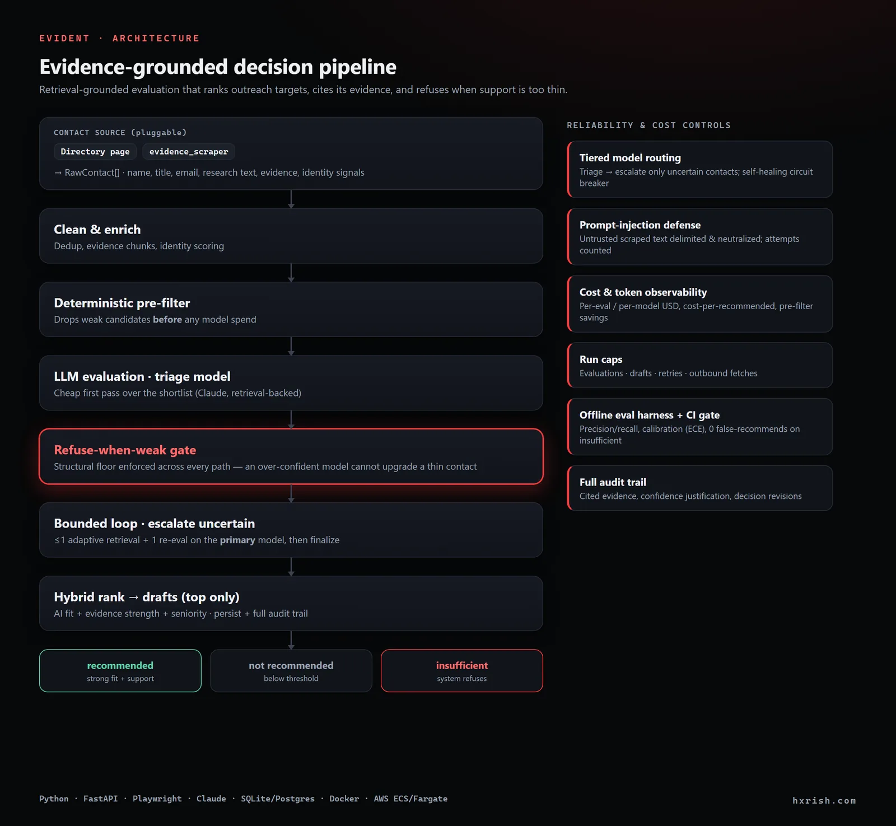
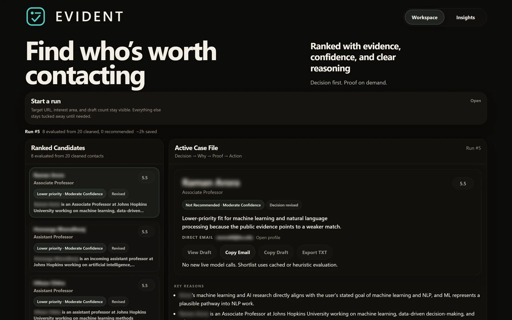
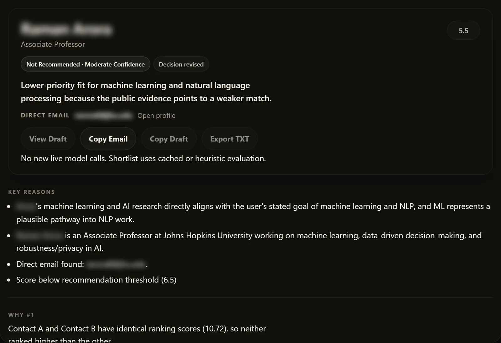
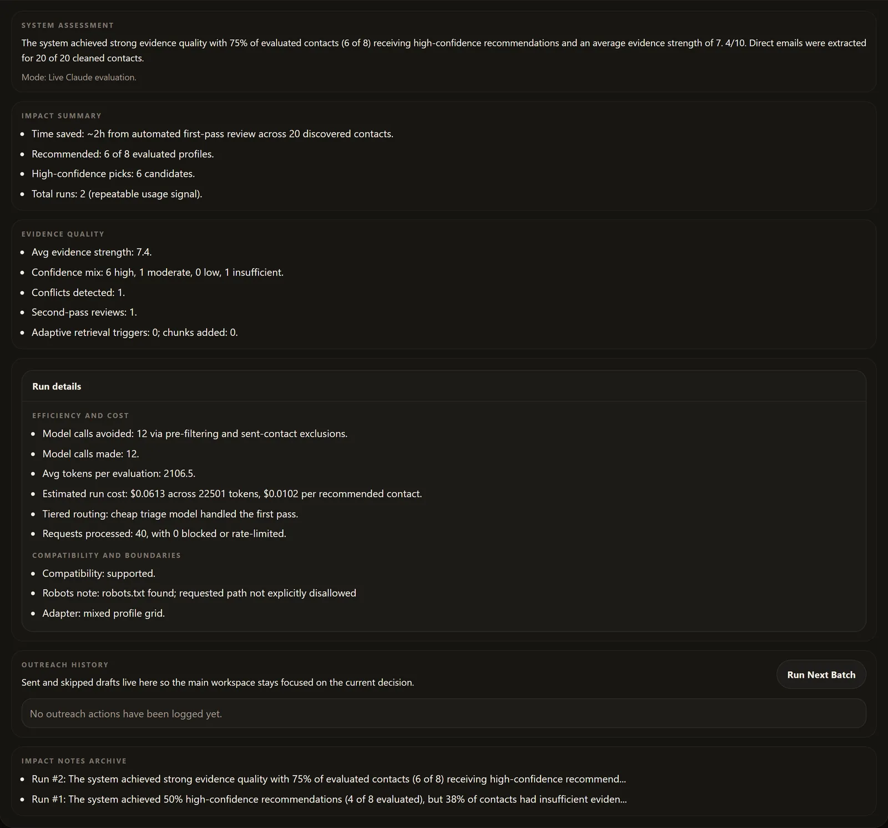

# Evident

**Evidence-grounded AI decision system for research outreach.**

Evident figures out who is worth contacting, explains why with cited
evidence, and holds back when the public evidence is too thin to justify
a recommendation. It's a decision system, not a scraper or a chatbot.

Live demo: on-demand AWS ECS deployment

---

## Evident: AI system that ranks outreach targets while minimizing hallucination and API cost

Evident is a bounded AI decision system that ranks research contacts with evidence-backed scoring, explicit uncertainty refusal, and cost-safe run limits.

### System architecture



### Why this is different

- Deterministic pre-filter reduces unnecessary model calls before LLM evaluation.
- Bounded uncertainty loop runs at most one extra retrieval and one re-check.
- Explicit refusal state returns `insufficient_evidence` instead of forcing a low-confidence decision.
- Full audit trail stores citations, confidence, and decision history per contact.

---

## Demo

This project is model-backed and not kept publicly hosted full-time to avoid unnecessary API and infrastructure cost.

Sample run shown in screenshots:
- Input: faculty/research directory URL + interest area
- Output:
  - ranked contacts
  - recommended / not recommended / insufficient evidence
  - reasoning + cited evidence
  - outreach drafts for top recommendations

---

## Modes (demo vs local)

Evident supports two operating modes using environment variables:

- `APP_MODE=demo`: public-facing, lower caps, optional `DEMO_API_KEY`, optional rate limits.
- `APP_MODE=local`: personal daily-use, no demo key, practical defaults for generating drafts.

Local mode does not depend on the cloud deployment being up.

---

## What it does

A user provides a faculty page URL and a research interest.
Evident runs a multi-stage pipeline and returns a ranked shortlist
of researchers worth contacting, with reasoning, evidence, and a
personalized draft email for each recommendation.

Pipeline stages:
1. Loads the target page safely (respects robots.txt, rate limits)
2. Extracts contacts deterministically, no AI used here
3. Enriches each contact with evidence from public profile pages
4. Pre-filters to the top candidates before spending model budget
5. Evaluates each shortlisted contact with Claude (retrieval-backed)
6. Runs a bounded agent loop on uncertain cases: one adaptive retrieval pass, then one second-pass re-evaluation
7. Ranks using a hybrid score: AI fit + evidence strength + seniority
8. Drafts personalized outreach emails for recommended contacts only

Three possible outcomes per contact:
- **Recommended** - strong fit, sufficient evidence
- **Not recommended** - evaluated but does not meet threshold
- **Insufficient evidence** - system refuses to decide

---

## What makes this different

- Deterministic pre-filter before any model call (cuts API cost by avoiding obvious weak contacts)
- Explicit refusal state, the system can say "I don't know"
- Bounded agentic loop for uncertainty: evaluate -> adaptive retrieval -> second pass -> finalize
- Second-pass reevaluation for uncertain contacts
- Decision revision tracking, shows when and why the decision changed
- Evidence agreement modeling, detects conflicting signals
- Full audit trail per contact: score breakdown, cited evidence,
  confidence justification, revision history

---

## Reliability engineering (measured, not asserted)

Evident treats the claims above as things to *prove*, not just build:

- **Offline evaluation harness + CI gate.** A labeled benchmark runs the real
  decision path against a stubbed model (no API calls) and reports per-class
  precision/recall/F1, a confusion matrix, confidence calibration (ECE +
  direction), and the safety metrics that define the product: **false-recommend
  rate on insufficient-evidence cases (target 0)** and prompt-injection
  resistance. Run `python -m eval.run`; it also runs in CI (`pytest tests/`) so
  any change that weakens "refuse when evidence is weak" fails the build.
- **Tiered model routing (cost-aware).** Every shortlisted contact is triaged on
  a cheaper model first; only *uncertain* contacts are escalated to the primary
  model on the second pass. A self-healing circuit breaker falls back to the
  primary model (not the heuristic path) if the triage model errors. Configure
  with `ANTHROPIC_TRIAGE_MODEL` / `ANTHROPIC_EVAL_MODEL`, or disable via
  `EVIDENT_TIERED_ROUTING=0`. The structural refusal floor applies to both tiers.
- **Prompt-injection defense.** Scraped, third-party text is the injection
  surface. Every untrusted field is wrapped in tamper-resistant delimiters
  (which the content cannot forge or close early), common override phrasings and
  fake role-turns are neutralized, and a security preamble tells the model that
  wrapped content is data, never instructions. The structural floor is still the
  last line of defense. Detected attempts are counted per run.
- **Cost & token observability.** Input/output tokens and estimated USD are
  tracked per evaluation and per model, surfaced as run cost, cost-per-recommended,
  and "model calls saved by the pre-filter" in the Insights view and `/metrics`.

The live system self-check is also exposed at `GET /eval`.

## Bounded agent loop

Evident uses a constrained uncertainty loop, not open-ended autonomy:

1. Evaluate shortlisted contacts
2. If uncertainty is high, trigger at most one adaptive retrieval pass (`ADAPTIVE_RETRIEVAL_MAX_CONTACTS`, default `1`)
3. Re-evaluate once
4. Finalize a decision (`recommended`, `not_recommended`, or `insufficient_evidence`)

This keeps behavior explainable, cost-aware, and reproducible in demos.

---

## Architecture

extractor -> enrichment -> prefilter -> evaluate -> rank -> draft
^                         ^
evidence chunks          second pass
identity signals         adaptive retrieval

Tech stack: Python · FastAPI · Playwright · SQLite/Postgres ·
Anthropic Claude · Server-Sent Events · Docker · AWS ECS/Fargate

---

## Product screens

> Contact names and emails are blurred in these screenshots. The app runs on
> real scraped data; this is real output with the personal info redacted.


Workspace: a ranked shortlist with the selected case file, recommendation, confidence, and reasoning.


Case file: cited evidence and an audit-style breakdown behind the decision (including an explicit "not recommended" when the evidence is too thin).


Run-level quality and the cost panel: estimated USD, cost-per-recommended, tiered model routing, second-pass counts, and adaptive retrieval metrics.

---

## Site coverage

Evident ingests contacts through a pluggable `ContactSource`, so it isn't tied to
one hardcoded parser:

- **Directory parser (default):** a deterministic faculty-page parser, validated
  against faculty-style directories (e.g. UAB, Johns Hopkins, NYU Langone). Pages
  outside this family return a compatibility report rather than failing silently.
- **Evidence scraper (pluggable):** a profile-driven, AI-assisted scraper engine
  (vendored under `evidence_scraper/`) that extracts the same contact shape from a
  much wider range of layouts, validated across 12+ university and law-firm
  directories, and feeds Evident's evaluation/refusal pipeline unchanged.

---

## Setup

```bash
git clone <repo>
cd evident
python -m venv venv && source venv/bin/activate
pip install -r requirements.txt
playwright install chromium
cp .env.example .env
# Add your ANTHROPIC_API_KEY to .env
uvicorn main:app --reload
```

Open http://localhost:8000

---

## How I use Evident locally every day

1. Set `APP_MODE=local` and `ANTHROPIC_API_KEY` in `.env`
2. Start the server: `uvicorn main:app --reload`
3. Open http://localhost:8000
4. Paste a faculty page URL + interest area
5. Generate up to **5 drafts per run** (default), then copy/export and mark sent/skipped

Local persistence (SQLite by default) stores:
runs, contacts, evaluations, drafts, outreach history, and evidence chunks.

---

## Environment variables

| Variable | Required | Description |
|---|---|---|
| ANTHROPIC_API_KEY | Yes (for live runs) | Claude API key |
| DATABASE_URL | No | Postgres URL (SQLite default) |
| DEMO_API_KEY | No | Restricts run endpoints to key holders |
| APP_MODE | No | `local` (daily use) or `demo` (public) |
| APP_BASIC_AUTH_USER | No | Basic auth for private deployment |
| APP_BASIC_AUTH_PASSWORD | No | Basic auth password |
| MAX_REQUESTS_PER_RUN | No | Cap on outbound fetches per run |
| MAX_DRAFTS_PER_RUN | No | Draft cap per run (defaults: local=5, demo=2) |
| MAX_EVALUATIONS_PER_RUN | No | Eval cap per run (defaults: local=12, demo=8) |
| ADAPTIVE_RETRIEVAL_MAX_CONTACTS | No | Max uncertain contacts to deep-retrieve per run (default: 1) |

---

## Cloud deployment

Docker image + AWS ECS/Fargate.
See `Dockerfile` and `apprunner.yaml` for config.
Anthropic key is injected via AWS Secrets Manager.

---

## What this is not

- Not a universal web scraper
- Not a bulk email sender
- Not a CRM
- Does not auto-send anything
- Does not bypass site restrictions or CAPTCHAs
